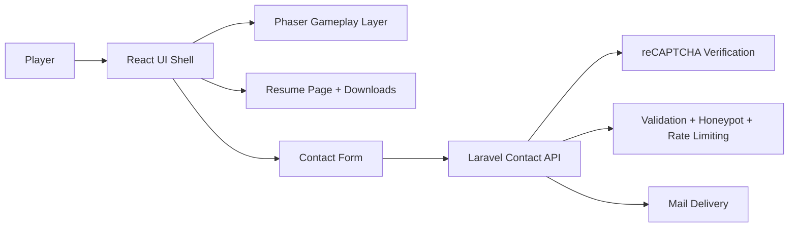
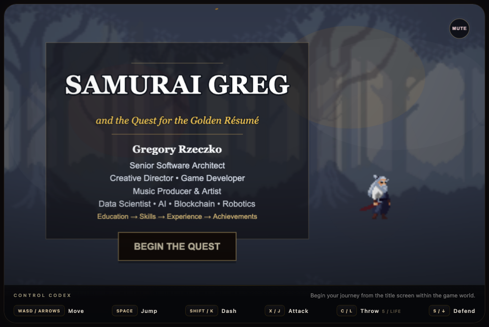
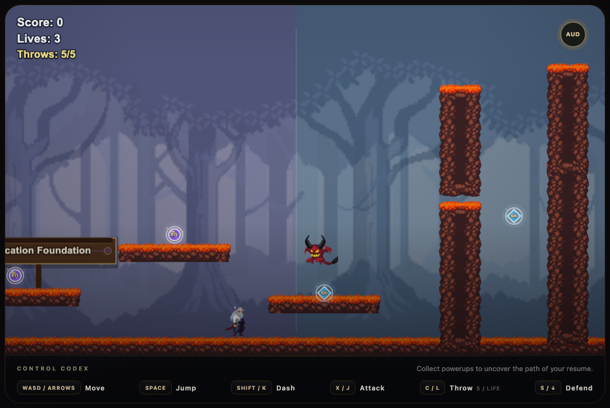
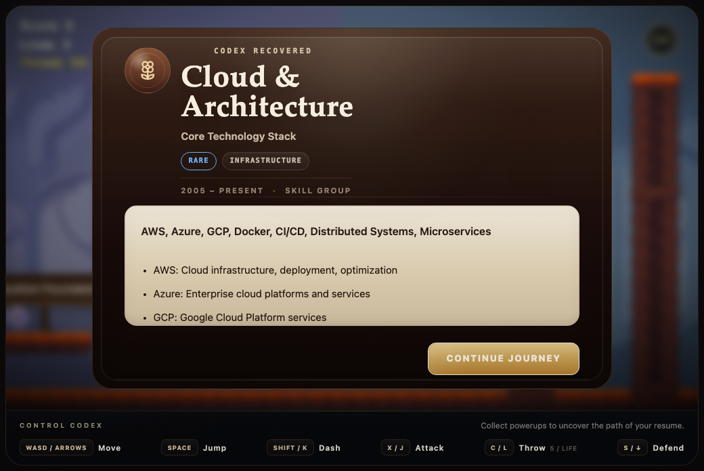
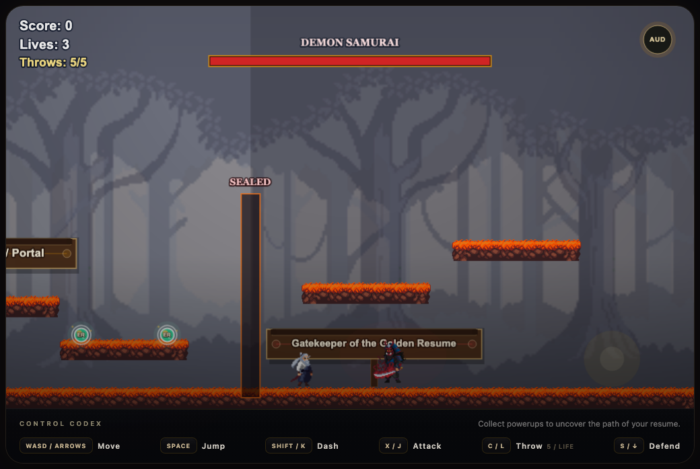
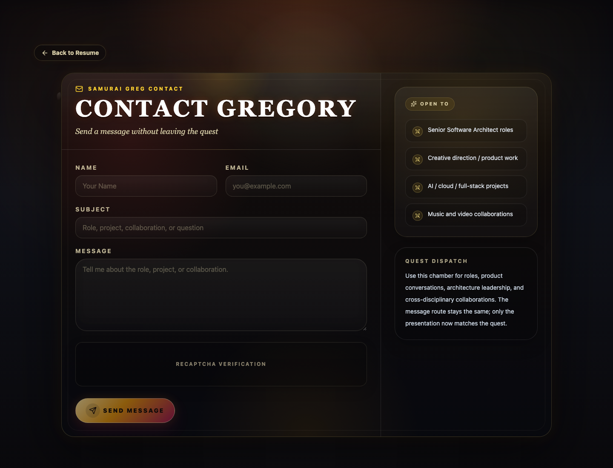
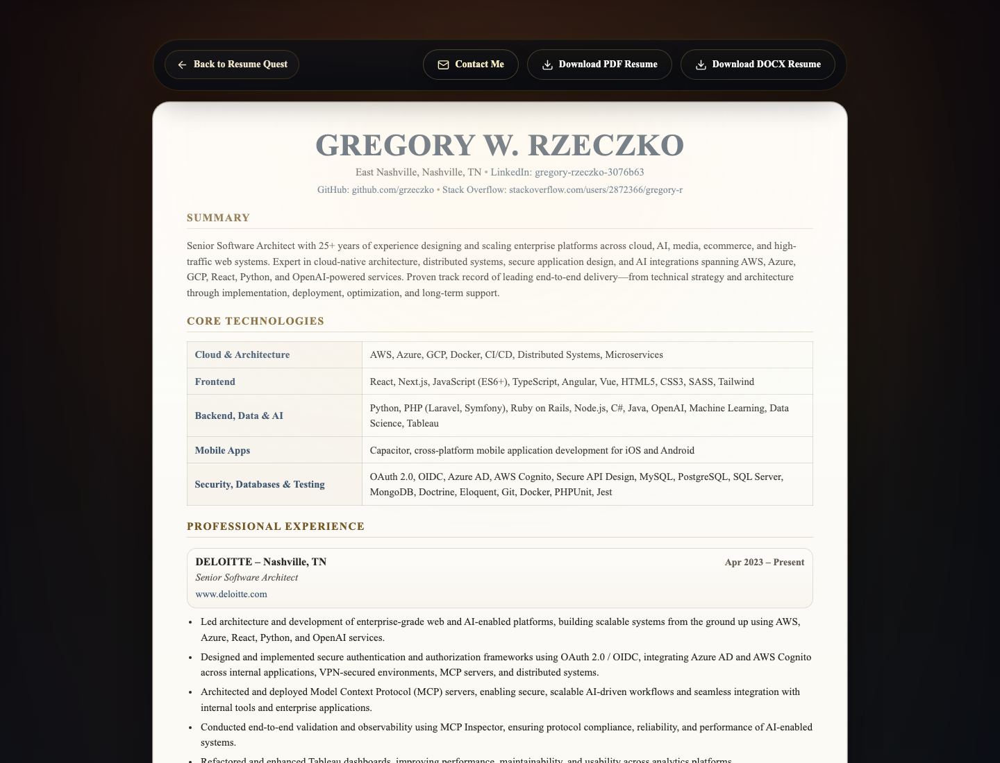

<div align="center">

# SAMURAI GREG
## and the Quest for the Golden Resume

*An interactive samurai-themed resume platformer built with Phaser, React, and Laravel.*

<p>
	
	
	
	
	
</p>

<p>
	
	
	
	
</p>

</div>

## 1. Hero Title Section

This repository is both a portfolio project and a full-stack game project: a playable side-scrolling resume experience where narrative, interaction, and engineering are treated as part of the same product.

At its core, this is a technical showcase disguised as a cinematic quest. Recruiters can scan a polished resume page, hiring teams can explore a custom React + Phaser gameplay layer, and engineers can inspect a clean frontend/backend split with production-minded Laravel API handling behind the scenes.

## 2. Project Description

*Samurai Greg and the Quest for the Golden Resume* reimagines a traditional resume as an interactive samurai-themed platformer. Instead of scrolling through a static document, players move through a stylized world, collect codex entries, absorb experience and skill milestones, confront enemies, and ultimately reclaim the Golden Resume in a final boss encounter.

The story mirrors a real career journey: from Connecticut, through nearly two decades of work in New York City, and onward to Nashville. That narrative arc becomes part of the product experience through cinematic UI overlays, ambient audio, collectible codex panels, a resume download system, and a full-stack contact flow powered by Laravel.

The result is designed to communicate several things at once:

- engineering depth
- product thinking
- frontend craft
- game systems literacy
- backend integration discipline
- visual and audio taste

## 3. Live Features

- Cinematic samurai intro sequence with story-driven onboarding
- Interactive resume codex system for surfacing skills, experience, and career milestones
- Platformer traversal with responsive movement and physics
- Wall jumping and wall-slide behavior
- Dash, attack, throw, and defend combat actions
- Demon enemy encounters and a final Demon Samurai boss battle
- Golden Resume retrieval loop that turns resume discovery into gameplay progression
- Atmospheric UI overlays and premium scroll/codex presentation
- Dynamic audio system with title, gameplay, and boss music states
- Resume download actions for PDF and DOCX files
- Dedicated resume page for traditional recruiter review
- Share flow for passing along the interactive experience
- Laravel-powered contact form with validation, rate limiting, honeypot protection, and reCAPTCHA
- Responsive frontend shell for game, resume, and contact experiences
- Leaderboard-ready foundation for future progression or score systems

## 4. Gameplay / Experience

The game loop is structured like a guided portfolio journey.

Players begin with a cinematic objective screen, then move through the world collecting lost codexes that represent capabilities, education, and professional history. Each codex reveal acts as both narrative reward and information architecture: instead of dumping resume content all at once, the project stages discovery through play.

As the journey progresses, the player masters traversal and combat mechanics, survives enemy encounters, and advances toward the final confrontation. The climax is a Demon Samurai boss fight guarding the Golden Resume, turning the final artifact into both a gameplay objective and a metaphor for the complete professional profile.

## 5. Tech Stack

### Frontend

- React 19
- Vite 8
- Phaser 4
- JavaScript (ES modules)
- CSS and game-specific interface styling
- React Router for game/resume/contact routing

### Backend

- Laravel 12
- PHP 8+
- SQLite by default for local setup
- MySQL-compatible deployment path
- Mail integration for contact delivery

### Game / UI

- Phaser Arcade Physics
- Sprite-sheet driven combat and movement animation
- Pixel art environments, enemies, and UI panels
- Audio state management for title, gameplay, and boss phases
- Responsive UI/UX for game shell, codex popups, resume view, and contact form

### Deployment

- GitHub repository workflow friendly
- Vite production build output in `frontend/dist`
- SiteGround-compatible Laravel + static frontend deployment strategy
- CI/CD-ready project split between frontend and backend services

## 6. Architecture

### Repository Structure

```text
/
├── frontend/          # React + Phaser application
│   ├── src/
│   │   ├── components/
│   │   ├── data/
│   │   ├── game/
│   │   │   ├── audio/
│   │   │   ├── entities/
│   │   │   ├── scenes/
│   │   │   └── utils/
│   │   └── services/
│   ├── assets/        # Game art, audio, and UI resources
│   └── resumes/       # Downloadable resume files
├── backend/           # Laravel API and mail delivery layer
│   ├── app/
│   ├── config/
│   ├── resources/
│   ├── routes/
│   └── tests/
└── docs/
		└── screenshots/   # README visuals and future capture assets
```

### Separation of Concerns

- `frontend/` owns gameplay, cinematic presentation, resume display, downloads, and contact form UX.
- `backend/` owns API delivery, validation, reCAPTCHA verification, throttling, honeypot handling, and outbound mail.
- The contact bridge is intentionally thin: the frontend posts to `/api/contact`, and Laravel handles trust boundaries and server-side enforcement.
- Resume content is modeled in frontend data modules, while downloadable artifacts live separately in `frontend/resumes/`.

### High-Level Flow



## 7. Screenshots / GIFs

Curated screenshots live in `docs/screenshots/` and show the current game, codex, boss, resume, and contact experiences.

### Intro Screen

The Phaser title screen introduces the samurai resume quest and keeps controls visible below the game frame.



### Gameplay

Core side-scrolling traversal with platforms, enemies, collectibles, combat controls, and HUD state.



### Codex Popup

Recovered codexes surface resume milestones as cinematic in-game rewards.



### Boss Battle

The Demon Samurai encounter guards the final Golden Resume portal.



### Contact Page

The Laravel-backed contact route is styled as a quest dispatch chamber.



### Resume Page

The traditional resume view remains available for recruiter-friendly scanning and downloads.



## 8. Controls

| Action | Controls |
|--------|----------|
| Move | `A / D` or `Left / Right Arrow` |
| Jump | `W`, `Up Arrow`, or `Space` |
| Defend | `S` or `Down Arrow` |
| Dash | `Shift` or `K` |
| Attack | `X` or `J` |
| Throw | `C` or `L` |

## 9. Audio / Atmosphere

The experience is built to feel cinematic rather than purely mechanical. Title music establishes tone before gameplay begins, core traversal is supported by an ambient gameplay track, and the boss encounter escalates with a dedicated final battle score. Sound effects for movement, combat, impacts, and codex interactions reinforce the samurai fantasy while fog, embers, layered UI textures, and scroll-based panels give the project a crafted, atmospheric identity.

## 10. Backend Features

- Laravel API endpoint for `POST /api/contact`
- server-side validation for message integrity
- Google reCAPTCHA verification hook
- honeypot-based spam suppression
- request throttling via Laravel middleware
- mail delivery flow compatible with Mailtrap during development
- test coverage for valid sends, CORS preflight, validation failures, reCAPTCHA failure, honeypot behavior, and rate limiting
- scalable API foundation for future leaderboard and persistence features

## 11. Deployment

### Production: SiteGround / rzeczko.com

Production deploys are handled by `.github/workflows/deploy-siteground.yml`.

- Pushes to `main` deploy to `https://rzeczko.com`
- Manual deploys are available through GitHub Actions `workflow_dispatch`
- `frontend/` is built with `npm ci` and `npm run build`
- `frontend/dist/` is synced to `$SITE_ROOT/public_html`
- `backend/` is synced to `$SITE_ROOT/backend`
- Server `.env`, `storage/`, `public/storage`, `vendor/`, and uploaded/runtime files are preserved
- Laravel release commands run on SiteGround after rsync, including Composer install, migrations, and cache rebuilds

Required GitHub Secrets:

```text
SSH_HOST
SSH_USER
SSH_KEY
SSH_PORT
SITE_ROOT=/home/customer/www/rzeczko.com
FRONTEND_ENV_FILE
LARAVEL_ENV_FILE
```

The generated production `.htaccess` routes `/api/*` to Laravel and falls back to `index.html` for React Router. The frontend should use `VITE_CONTACT_API_URL=https://rzeczko.com/api/contact` when that rewrite is active.

Full setup notes live in [`docs/deployment-siteground.md`](./docs/deployment-siteground.md).

### Build / Release Commands

```bash
cd frontend
npm install
npm run build

cd ../backend
composer install
php artisan test --filter=ContactApiTest
```

## 12. Future Features

- global leaderboard and run tracking
- achievement system tied to codex completion and boss clears
- mobile-first gameplay and controls optimization
- multiplayer challenge or asynchronous score mode
- additional boss encounters and themed stages
- expanded codex system with richer unlockables and animated reveals
- save-state or profile progression support
- analytics or recruiter engagement insights for portfolio review paths

## 13. Local Development

### Frontend

```bash
cd frontend
cp .env.example .env
npm install
npm run dev
```

### Backend

```bash
cd backend
cp .env.example .env
composer install
php artisan key:generate
php artisan serve
```

### Environment Notes

- Set `VITE_CONTACT_API_URL=http://127.0.0.1:8000/api/contact` for local frontend-to-backend communication.
- Configure backend mail credentials before testing contact delivery.
- Provide `RECAPTCHA_SECRET_KEY` on the backend and `VITE_RECAPTCHA_SITE_KEY` on the frontend when enabling the production contact flow.

## 14. Credits

- Gregory Rzeczko for concept, engineering, design direction, resume content, and world-building
- Samurai Greg as the playable narrative persona and portfolio frame
- Phaser for the game engine layer
- React for the application shell and interface composition
- Laravel for the API, validation, and mail delivery layer
- asset creators and pack authors whose art/audio resources support the project presentation where applicable inside the repository asset folders

## 15. License

This project is intended to be released under the MIT License.

If you want to formalize that for the public repository, add a root `LICENSE` file with the standard MIT text.

<div align="center">

[Built with Phaser 4](https://phaser.io/phaser4) | [GitHub Repo](https://github.com/grzeczko/samurai-greg)

</div>
